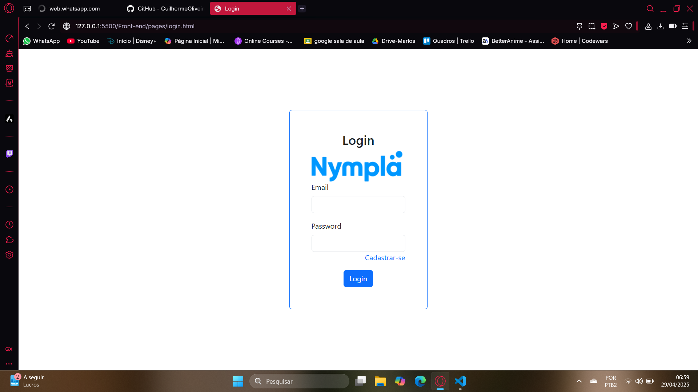
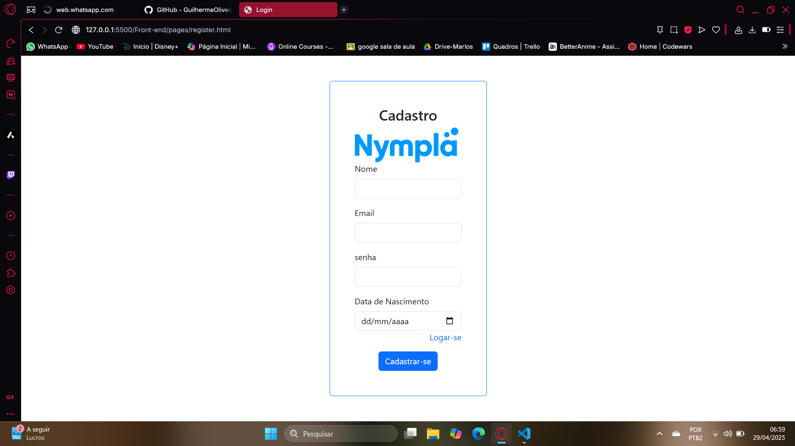
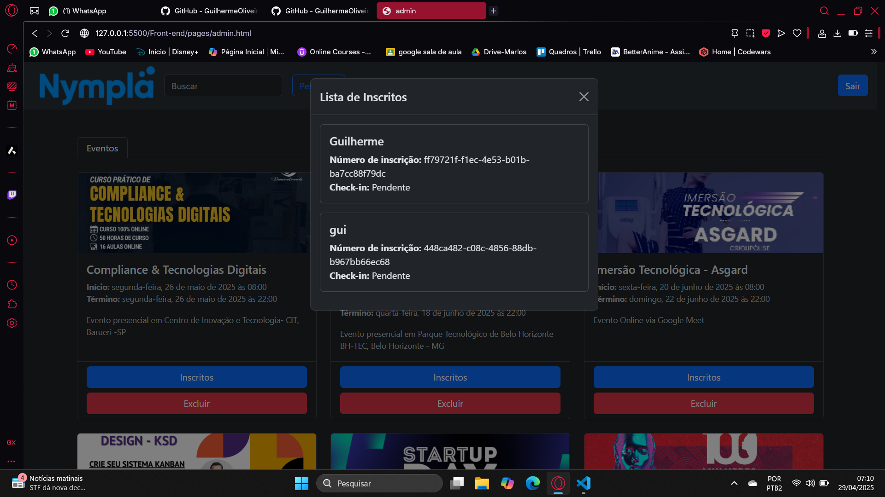

# Projeto Nympla

O projeto consiste em um sistema de gerenciamento de eventos e usuários semelhante ao site Sympla. O sistema irá possibilitar a inscrição em eventos, cadastro e login de usuários, autenticação e autorização, entre outras funcionalidades.

## Design 

Design das principais telas do projeto.







## funcionalidades

- [x] Login
- [x] Cadastro de usuários
- [x] Listar eventos disponíveis 
- [x] Buscar eventos
- [x] Listar eventos cadastrados
- [x] Fazer inscrição
- [x] Cancelar inscrição
- [x] Logout 
- [x] Excluir evento
- [x] Listar inscritos no evento


## Endpoints
```
GET http://localhost:8080/user/all
Listar todos os usuários

POST http://localhost:8080/user/register
Registrar um novo usuário

POST http://localhost:8080/user/login
Fazer login do usuário

GET http://localhost:8080/event/all
Listar todos os eventos

GET http://localhost:8080/event/:search
Buscar eventos por nome

GET http://localhost:8080/subscription/all
Listar todas as inscrições

GET http://localhost:8080/subscription/:id
Buscar inscrições por ID do usuário

POST http://localhost:8080/subscription/create
Criar uma nova inscrição

DELETE http://localhost:8080/subscription/delete/
Deletar uma inscrição

POST http://localhost:8080/auth/profile
Perfil do usuário autenticado

POST http://localhost:8080/auth/admin
Perfil do administrador autenticado

GET http://localhost:8080/admin/subscriptions/:id
Listar inscrições por ID do evento (administrador)

DELETE http://localhost:8080/admin/event/delete/:id
Deletar um evento (administrador)
```